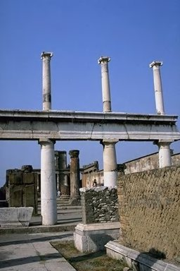
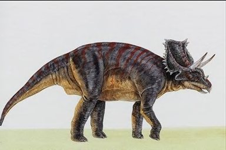
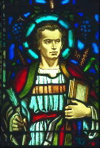

# Dual-Layer Neighborhood Image Texture Construction & Color Extraction Method
This repository presents an innovative approach for image retrieval and pattern recognition, with potential applications in fields such as medical imaging and large-scale dataset analysis. The proposed method integrates two novel features:

1. **Dual-Layer Neighborhood Texture Construction Model**: This model constructs image textures by simultaneously leveraging information from two layers of neighboring pixels. It enhances texture analysis and pattern extraction, leading to more accurate results in identifying and distinguishing image features.

2. **Probabilistic Color Extraction Method**: A color extraction technique based on the discrete joint probability distribution of the RGB channels. This probabilistic approach allows for more precise color feature extraction, contributing to the overall robustness of the model.

In addition, the algorithm incorporates the **Extended Canberra Distance** for comparing feature vectors, improving the precision of image retrieval.

The effectiveness of this method has been validated on benchmark datasets, including **Wang (Corel-1k)** and **Corel-10k**, demonstrating superior precision in comparison with other existing methods.

## 1K images

## 10K images

