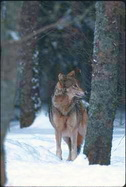
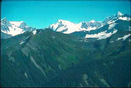

# Local Average Binary Pattern (LABP) Texture Construction & Color Extraction Method

This repository presents an innovative approach for image retrieval and pattern recognition. The method integrates two main features:

1. **Local Average Binary Pattern (LABP)**: This technique constructs image textures by utilizing information from two layers of neighboring pixels, enhancing texture analysis and pattern extraction. It leads to more accurate results in identifying and distinguishing image features.

2. **Probabilistic Color Extraction Method**: A color extraction technique based on a discrete joint probability distribution of the RGB channels. This method precisely captures color features by quantizing the RGB values and contributes to the overall robustness of the model.

Additionally, the algorithm incorporates various distance metrics, such as **Extended Canberra Distance**, **Canberra Distance**, **Square Chord Distance**, **Chi-Square Distance**, and **Euclidean Distance**, for comparing feature vectors, further improving the precision of image retrieval tasks.

The approach has been validated on benchmark datasets like **Wang (Corel-1k)** and **Corel-10k**, demonstrating superior performance in precision and recall when compared to other existing methods.

## 1K images


## 10K images






## Features

### Local Average Binary Pattern (LABP)
LABP is a texture descriptor that improves upon classical LBP by averaging intensity values over two layers of neighboring pixels. This provides a more nuanced understanding of texture, making it useful for tasks like medical imaging and large-scale image retrieval.

### Probabilistic Color Extraction
This method quantizes the RGB channels into fixed bins, creating a joint probability distribution over the RGB values, thus capturing color features more precisely. By calculating histograms over the quantized values, the method allows for robust color-based image retrieval.

### Distance Metrics for Feature Comparison
The repository includes multiple distance metrics for comparing feature vectors:
- **Extended Canberra Distance**
- **Canberra Distance**
- **Square Chord Distance**
- **Chi-Square Distance**
- **Euclidean Distance**

These metrics provide flexible ways to compare texture and color features, offering improvements in precision and recall in image retrieval tasks.

## How to Run the Project

### 1. Clone the Repository

To get started, clone the repository:

```bash
git clone https://github.com/your-username/labp-color-extraction.git
cd labp-color-extraction
```
### 2. Install Dependencies
Make sure you have Python 3.x installed. Then, install the required dependencies using pip
```bash
pip install -r requirements.txt
```
### 2. make sure you have the datasets
for diownloading dataset please use this link (Google Drive):


